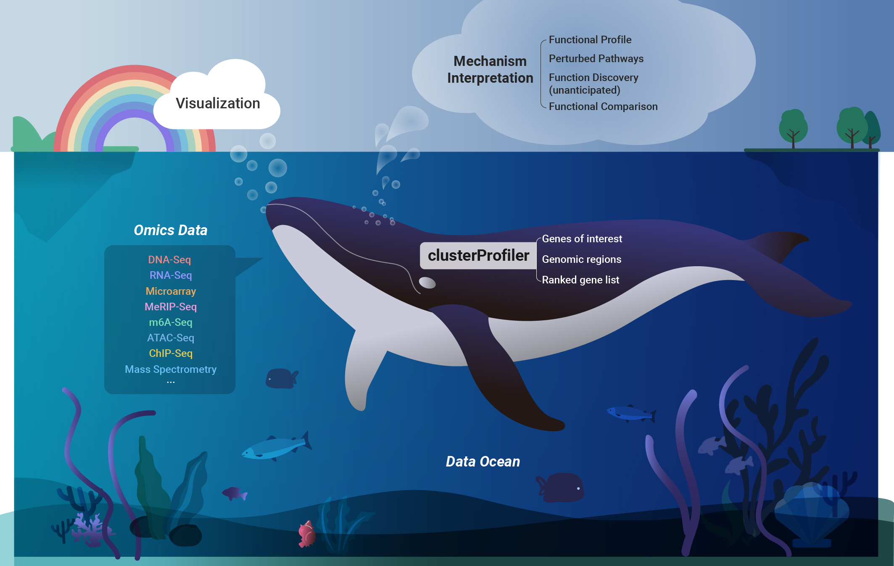

```{r echo=FALSE, results="hide", message=FALSE}
library("badger")
#library("ypages")
Biocpkg <- function (pkg) {
    sprintf("[%s](http://bioconductor.org/packages/%s)", pkg, pkg)
}
```


#  clusterProfiler


[](http://www.repostatus.org/#active)
`r badge_bioc_release("clusterProfiler", "green")`
`r badge_devel("guangchuangyu/clusterProfiler", "green")`
[](https://www.bioconductor.org/packages/devel/bioc/html/clusterProfiler.html#since)


[](https://www.bioconductor.org/packages/devel/bioc/html/clusterProfiler.html#archives)
[](https://bioconductor.org/checkResults/devel/bioc-LATEST/clusterProfiler/)
[](https://travis-ci.org/GuangchuangYu/clusterProfiler)
[](https://ci.appveyor.com/project/GuangchuangYu/clusterProfiler)
[](https://codecov.io/gh/GuangchuangYu/clusterProfiler/)

<!--
[)`-green.svg)](https://github.com/GuangchuangYu/clusterProfiler/commits/master)
-->


+ `r Biocpkg("clusterProfiler")` supports exploring functional characteristics of both coding and non-coding genomics data for thousands of species with up-to-date gene annotation.
+ It provides a universal interface for gene functional annotation from a variety of sources and thus can be applied in diverse scenarios. 
+ It provides a tidy interface to access, manipulate, and visualize enrichment results to help users achieve efficient data interpretation
+ Datasets obtained from multiple treatments and time points can be analyzed and compared in a single run, easily revealing functional consensus and differences among distinct conditions


For details, please visit <https://yulab-smu.top/biomedical-knowledge-mining-book/>.





## :writing_hand: Authors

Guangchuang YU  <https://yulab-smu.top>

School of Basic Medical Sciences, Southern Medical University


[](https://twitter.com/intent/tweet?hashtags=clusterProfiler&url=http://online.liebertpub.com/doi/abs/10.1089/omi.2011.0118&screen_name=guangchuangyu)
[](https://saythanks.io/to/GuangchuangYu)
`r badger::badge_custom('follow me on', 'WeChat', 'green', 'https://guangchuangyu.github.io/blog_images/biobabble.jpg')`


------------------------------------------------------------------------


If you use `r Biocpkg("clusterProfiler")` in published research, please cite the most appropriate paper(s) from this list:


1. T Wu<sup>#</sup>, E Hu<sup>#</sup>, S Xu, M Chen, P Guo, Z Dai, T Feng, L Zhou, W Tang, L Zhan, X Fu, S Liu, X Bo<sup>\*</sup>, **G Yu**<sup>\*</sup>. clusterProfiler 4.0: A universal enrichment tool for interpreting omics data. **_The Innovation_**. 2021, 2(3):100141.
doi: [10.1016/j.xinn.2021.100141](https://doi.org/10.1016/j.xinn.2021.100141)
2. __G Yu__^\*^. Gene Ontology Semantic Similarity Analysis Using GOSemSim. In: Kidder B. (eds) Stem Cell Transcriptional Networks. __*Methods in Molecular Biology*__. 2020, 2117:207-215. Humana, New York, NY.
doi: [10.1007/978-1-0716-0301-7_11](https://doi.org/10.1007/978-1-0716-0301-7_11)
3. __G Yu__^\*^. Using meshes for MeSH term enrichment and semantic analyses. __*Bioinformatics*__. 2018, 34(21):3766–3767.
doi: [10.1093/bioinformatics/bty410](https://doi.org/10.1093/bioinformatics/bty410)
4. __G Yu__, QY He^\*^. ReactomePA: an R/Bioconductor package for reactome pathway analysis and visualization. __*Molecular BioSystems*__. 2016, 12(2):477-479.
doi: [10.1039/C5MB00663E](https://doi.org/10.1039/C5MB00663E)
5. __G Yu__^\*^, LG Wang, and QY He^\*^. ChIPseeker: an R/Bioconductor package for ChIP peak annotation, comparison and visualization. __*Bioinformatics*__. 2015, 31(14):2382-2383.
doi: [10.1093/bioinformatics/btv145](https://doi.org/10.1093/bioinformatics/btv145)
6. __G Yu__^\*^, LG Wang, GR Yan, QY He^\*^. DOSE: an R/Bioconductor package for Disease Ontology Semantic and Enrichment analysis. __*Bioinformatics*__. 2015, 31(4):608-609.
doi: [10.1093/bioinformatics/btu684](https://doi.org/10.1093/bioinformatics/btu684)
7. __G Yu__, LG Wang, Y Han and QY He^\*^. clusterProfiler: an R package for comparing biological themes among gene clusters. __*OMICS: A Journal of Integrative Biology*__. 2012, 16(5):284-287.
doi: [10.1089/omi.2011.0118](https://doi.org/10.1089/omi.2011.0118)
8. __G Yu__, F Li, Y Qin, X Bo^\*^, Y Wu, S Wang^\*^. GOSemSim: an R package for measuring semantic similarity among GO terms and gene products. __*Bioinformatics*__. 2010, 26(7):976-978.
doi: [10.1093/bioinformatics/btq064](https://doi.org/10.1093/bioinformatics/btq064)


<!--


 r badge_custom("1st most cited paper", "in OMICS", "green",
  "http://online.liebertpub.com/action/showMostCitedArticles?journalCode=omi")`
 r badge_custom("ESI", "Highly Cited Paper", "green")`
 r badge_doi("10.1089/omi.2011.0118", "green")`


------------------------------------------------------------------------

### Citation


### Download stats

r badge_download_bioc("clusterProfiler")
r badge_bioc_download("clusterProfiler", "total", "blue")
r badge_bioc_download("clusterProfiler", "month", "blue")


-->
