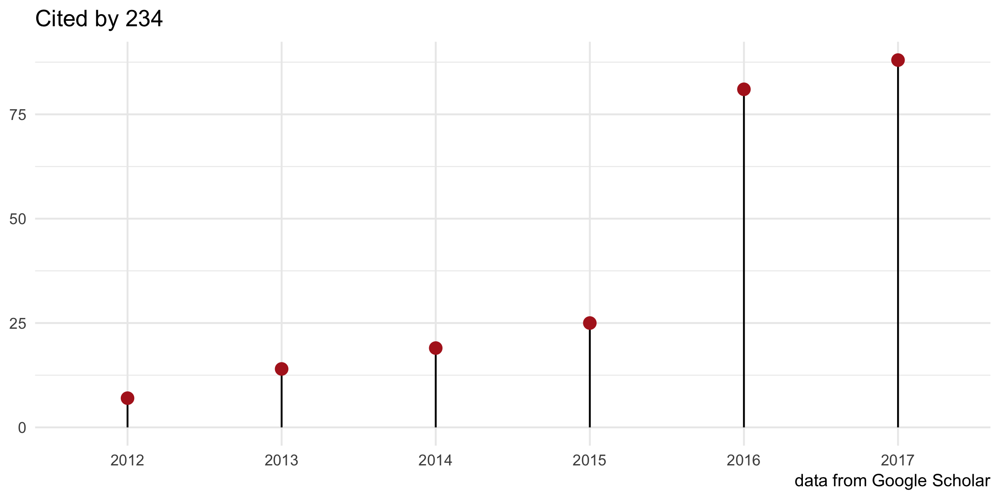
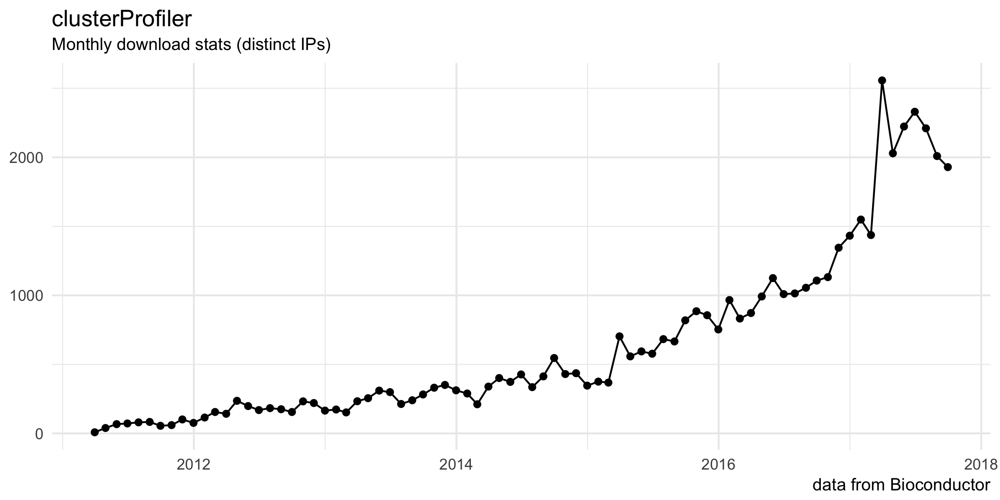

clusterProfiler
===============

    

     

   

This package implements methods to analyze and visualize functional profiles of genomic coordinates (supported by [ChIPseeker](http://www.bioconductor.org/packages/ChIPseeker)), gene and gene clusters.

For details, please visit our project website, <https://guangchuangyu.github.io/clusterProfiler>.

-   [Documentation](https://guangchuangyu.github.io/clusterProfiler/documentation/)
-   [Featured Articles](https://guangchuangyu.github.io/clusterProfiler/featuredArticles/)
-   [Feedback](https://guangchuangyu.github.io/clusterProfiler/#feedback)

------------------------------------------------------------------------

Please cite the following article when using `clusterProfiler`:

***Yu G***, Wang L, Han Y and He Q\*. clusterProfiler: an R package for comparing biological themes among gene clusters. OMICS: A Journal of Integrative Biology. 2012, 16(5):284-287.

 

------------------------------------------------------------------------

### Citation

  

### Download stats

  

