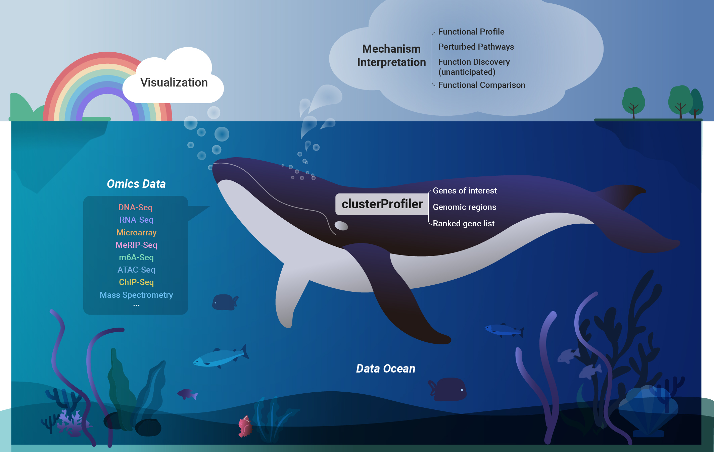

# clusterProfiler

<!--

-->

- [clusterProfiler](http://bioconductor.org/packages/clusterProfiler)
  supports exploring functional characteristics of both coding and
  non-coding genomics data for thousands of species with up-to-date gene
  annotation.
- It provides a universal interface for gene functional annotation from
  a variety of sources and thus can be applied in diverse scenarios.
- It provides a tidy interface to access, manipulate, and visualize
  enrichment results to help users achieve efficient data interpretation
- Datasets obtained from multiple treatments and time points can be
  analyzed and compared in a single run, easily revealing functional
  consensus and differences among distinct conditions
- It uses `enrichit` as the underlying engine for ORA, GSEA, and
  topology-aware enrichment analysis, while providing a high-level and
  user-friendly interface for biological interpretation

For details, please visit:

- <https://yulab-smu.top/contribution-knowledge-mining/>
- <https://yulab-smu.top/biomedical-knowledge-mining-book/>

## :writing_hand: Authors

Guangchuang YU <https://yulab-smu.top>

School of Basic Medical Sciences, Southern Medical University

