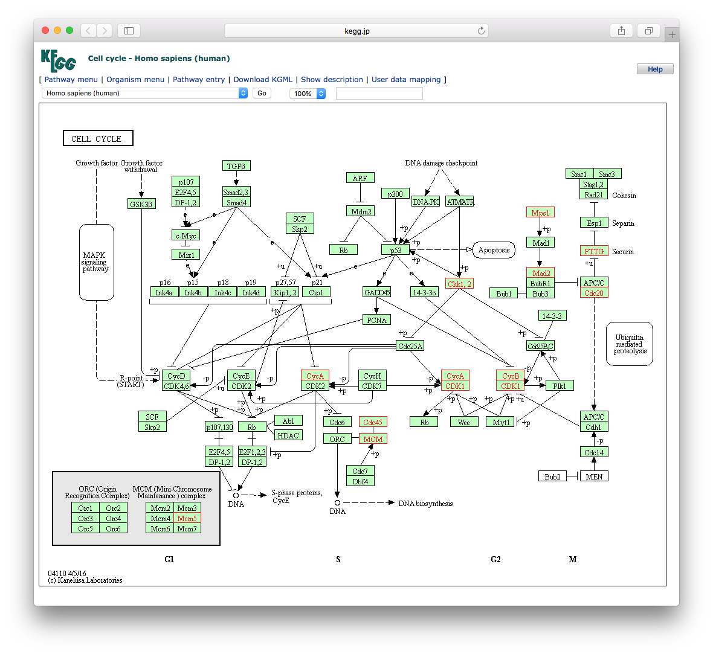
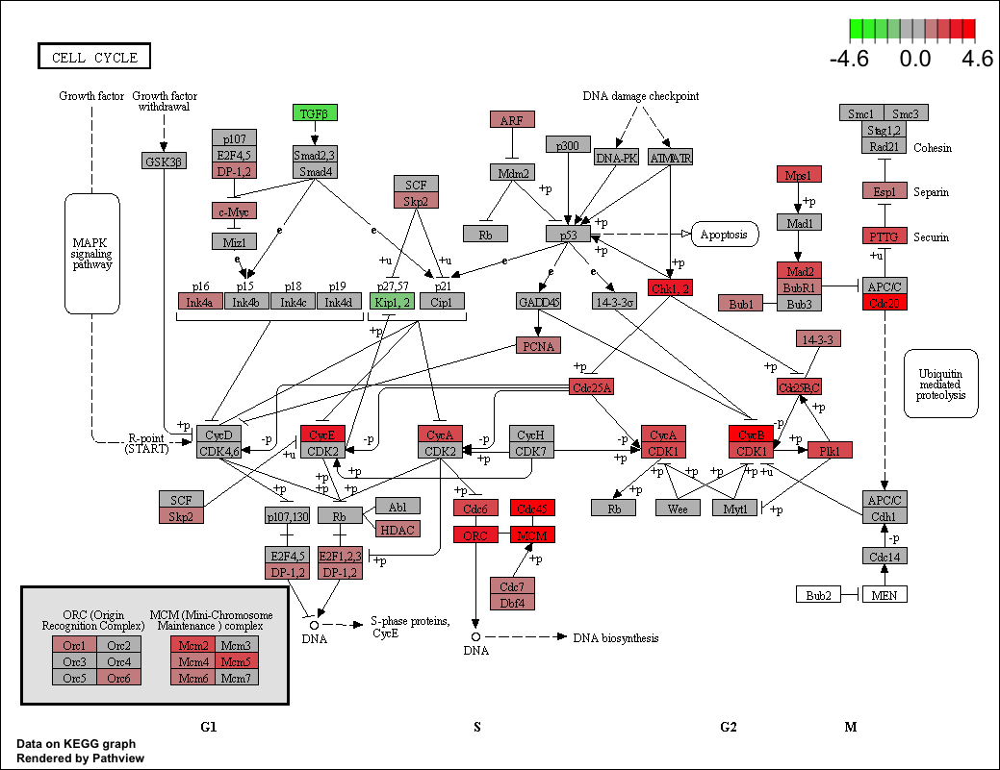

```{r style, echo=FALSE, results="asis", message=FALSE}
knitr::opts_chunk$set(tidy = FALSE,
                      warning = FALSE,
                      message = FALSE)
```

```{r echo=FALSE, results='hide', message=FALSE}
library(dplyr)
library(tidyr)
library(DOSE)
library(GO.db)
library(org.Hs.eg.db)
library(GSEABase)
library(clusterProfiler)
```

# Abstract

[clusterProfiler](https://www.bioconductor.org/packages/clusterProfiler) implements methods to analyze and visualize functional profiles of genomic coordinates (supported by [ChIPseeker](https://www.bioconductor.org/packages/ChIPseeker)), gene and gene clusters.

## Supported Analysis

+ Over-Representation Analysis
+ Gene Set Enrichment Analysis
+ Biological theme comparison

## Supported ontologies/pathways

+ Disease Ontology (via [DOSE](https://www.bioconductor.org/packages/DOSE))
+ [Network of Cancer Gene](http://ncg.kcl.ac.uk/) (via [DOSE](https://www.bioconductor.org/packages/DOSE))
+ [DisGeNET](http://www.disgenet.org/web/DisGeNET/menu/home) (via [DOSE](https://www.bioconductor.org/packages/DOSE))
+ Gene Ontology (supports many species with GO annotation query online via [AnnotationHub](https://bioconductor.org/packages/AnnotationHub/))
+ KEGG Pathway and Module with latest online data (supports more than 4000 species listed in <http://www.genome.jp/kegg/catalog/org_list.html>)
+ Reactome Pathway (via [ReactomePA](https://www.bioconductor.org/packages/ReactomePA))
+ DAVID (via [RDAVIDWebService](https://www.bioconductor.org/packages/RDAVIDWebService))
+ [Molecular Signatures Database](http://software.broadinstitute.org/gsea/msigdb)
	* hallmark gene sets
	* positional gene sets
	* curated gene sets
	* motif gene sets
	* computational gene sets
	* GO gene sets
	* oncogenic signatures
	* immunologic signatures
+ Other Annotations
	* from other sources (e.g. [DisGeNET](http://www.disgenet.org/web/DisGeNET/menu/home) as [an example](https://guangchuangyu.github.io/2015/05/use-clusterprofiler-as-an-universal-enrichment-analysis-tool/))
	* user's annotation
	* customized ontology
	* and many others

## Visualization

+ barplot
+ cnetplot
+ dotplot
+ emapplot
+ gseaplot
+ goplot
+ upsetplot


# Citation

If you use [clusterProfiler](https://www.bioconductor.org/packages/clusterProfiler) in published research, please cite:


__*G Yu*__, LG Wang, Y Han, QY He. clusterProfiler: an R package for comparing biological themes among gene clusters. **_OMICS: A Journal of Integrative Biology_** 2012, 16(5):284-287. doi:[10.1089/omi.2011.0118](http://dx.doi.org/10.1089/omi.2011.0118)


# Introduction

In recently years, high-throughput experimental techniques such as
microarray, RNA-Seq and mass spectrometry can detect cellular
molecules at systems-level. These kinds of analyses generate huge
quantitaties of data, which need to be given a biological
interpretation. A commonly used approach is via clustering in the gene
dimension for grouping different genes based on their similarities[@yu2010].

To search for shared functions among genes, a common way is to
incorporate the biological knowledge, such as Gene Ontology (GO) and
Kyoto Encyclopedia of Genes and Genomes (KEGG), for identifying
predominant biological themes of a collection of genes.

After clustering analysis, researchers not only want to determine
whether there is a common theme of a particular gene cluster, but also
to compare the biological themes among gene clusters. The manual step
to choose interesting clusters followed by enrichment analysis on each
selected cluster is slow and tedious. To bridge this gap, we designed
[clusterProfiler](https://www.bioconductor.org/packages/clusterProfiler)[@yu2012], for comparing and visualizing functional
profiles among gene clusters.

# `bitr`: Biological Id TranslatoR

[clusterProfiler](https://www.bioconductor.org/packages/clusterProfiler) provides `bitr` and `bitr_kegg` for converting ID types. Both `bitr` and `bitr_kegg` support many species including model and many non-model organisms.

```{r}
x <- c("GPX3",  "GLRX",   "LBP",   "CRYAB", "DEFB1", "HCLS1",   "SOD2",   "HSPA2",
       "ORM1",  "IGFBP1", "PTHLH", "GPC3",  "IGFBP3","TOB1",    "MITF",   "NDRG1",
       "NR1H4", "FGFR3",  "PVR",   "IL6",   "PTPRM", "ERBB2",   "NID2",   "LAMB1",
       "COMP",  "PLS3",   "MCAM",  "SPP1",  "LAMC1", "COL4A2",  "COL4A1", "MYOC",
       "ANXA4", "TFPI2",  "CST6",  "SLPI",  "TIMP2", "CPM",     "GGT1",   "NNMT",
       "MAL",   "EEF1A2", "HGD",   "TCN2",  "CDA",   "PCCA",    "CRYM",   "PDXK",
       "STC1",  "WARS",  "HMOX1", "FXYD2", "RBP4",   "SLC6A12", "KDELR3", "ITM2B")
eg = bitr(x, fromType="SYMBOL", toType="ENTREZID", OrgDb="org.Hs.eg.db")
head(eg)
```

User should provides an annotation package, both _fromType_ and _toType_ can accept any types that supported.

User can use _keytypes_ to list all supporting types.

```{r}
library(org.Hs.eg.db)
keytypes(org.Hs.eg.db)
```

We can translate from one type to other types.
```{r}
ids <- bitr(x, fromType="SYMBOL", toType=c("UNIPROT", "ENSEMBL"), OrgDb="org.Hs.eg.db")
head(ids)
```

For GO analysis, user don't need to convert ID, all ID type provided by `OrgDb` can be used in `groupGO`, `enrichGO` and `gseGO` by specifying `keyType` parameter.

## `bitr_kegg`: converting biological IDs using KEGG API


```{r}
data(gcSample)
hg <- gcSample[[1]]
head(hg)

eg2np <- bitr_kegg(hg, fromType='kegg', toType='ncbi-proteinid', organism='hsa')
head(eg2np)
```

The ID type (both `fromType` & `toType`) should be one of 'kegg', 'ncbi-geneid', 'ncbi-proteinid' or 'uniprot'. The 'kegg' is the primary ID used in KEGG database. The data source of KEGG was from NCBI. A rule of thumb for the 'kegg' ID is `entrezgene` ID for eukaryote species and `Locus` ID for prokaryotes.

Many prokaryote species don't have entrezgene ID available. For example we can check the gene information of `ece:Z5100` in <http://www.genome.jp/dbget-bin/www_bget?ece:Z5100>, which have `NCBI-ProteinID` and `UnitProt` links in the `Other DBs` Entry, but not `NCBI-GeneID`.


If we try to convert `Z5100` to `ncbi-geneid`, `bitr_kegg` will throw error of `ncbi-geneid is not supported`.

```{r eval=FALSE}
bitr_kegg("Z5100", fromType="kegg", toType='ncbi-geneid', organism='ece')
```

```
## Error in KEGG_convert(fromType, toType, organism) :
## ncbi-geneid is not supported for ece ...
```

We can of course convert it to `ncbi-proteinid` and `uniprot`:

```{r}
bitr_kegg("Z5100", fromType="kegg", toType='ncbi-proteinid', organism='ece')
bitr_kegg("Z5100", fromType="kegg", toType='uniprot', organism='ece')
```


# GO Analysis

## Supported organisms

GO analyses (`groupGO()`, `enrichGO()` and `gseGO()`) support organisms that have an `OrgDb` object available.

Bioconductor have already provide `OrgDb` for about [20 species](http://bioconductor.org/packages/release/BiocViews.html#___OrgDb). User can query `OrgDb` online by [AnnotationHub](https://www.bioconductor.org/packages/AnnotationHub) or build their own by [AnnotationForge](https://www.bioconductor.org/packages/AnnotationForge). An example can be found in the [vignette](https://bioconductor.org/packages/devel/bioc/vignettes/GOSemSim/inst/doc/GOSemSim.html#supported-organisms) of [GOSemSim](https://www.bioconductor.org/packages/GOSemSim).

If user have GO annotation data (in data.frame format with first column of gene ID and second column of GO ID), they can use `enricher()` and `gseGO()` functions to perform over-representation test and gene set enrichment analysis.

If genes are annotated by direction annotation, it should also annotated by its ancestor GO nodes (indirect annation). If user only has direct annotation, they can pass their annotation to `buildGOmap` function, which will infer indirection annotation and generate a `data.frame` that suitable for both `enricher()` and `gseGO()`.

## GO classification

In [clusterProfiler](https://www.bioconductor.org/packages/clusterProfiler), `groupGO` is designed for gene classification based on GO distribution at a specific level. Here we use dataset `geneList` provided by [DOSE](https://www.bioconductor.org/packages/DOSE). Please refer to vignette of [DOSE](https://www.bioconductor.org/packages/DOSE) for more details.

```{r warning=FALSE}
data(geneList, package="DOSE")
gene <- names(geneList)[abs(geneList) > 2]
gene.df <- bitr(gene, fromType = "ENTREZID",
	   	toType = c("ENSEMBL", "SYMBOL"),
		OrgDb = org.Hs.eg.db)
head(gene.df)
ggo <- groupGO(gene     = gene,
               OrgDb    = org.Hs.eg.db,
               ont      = "CC",
               level    = 3,
               readable = TRUE)

head(ggo)
```

The input parameters of _gene_ is a vector of gene IDs (can be any ID type that supported by corresponding `OrgDb`).

If _readable_ is setting to _TRUE_, the input gene IDs will be converted to gene symbols.


## GO over-representation test


Over-representation test[@boyle2004] were implemented in [clusterProfiler](https://www.bioconductor.org/packages/clusterProfiler). For calculation details and explanation of paramters, please refer to the vignette of [DOSE](https://www.bioconductor.org/packages/DOSE).

```{r}
ego <- enrichGO(gene          = gene,
                universe      = names(geneList),
                OrgDb         = org.Hs.eg.db,
                ont           = "CC",
                pAdjustMethod = "BH",
                pvalueCutoff  = 0.01,
                qvalueCutoff  = 0.05,
		readable      = TRUE)
head(ego)
```

As I mentioned before, any gene ID type that supported in `OrgDb` can be directly used in GO analyses. User need to specify the `keyType` parameter to specify the input gene ID type.

```{r eval=FALSE}
ego2 <- enrichGO(gene         = gene.df$ENSEMBL,
                OrgDb         = org.Hs.eg.db,
                keyType       = 'ENSEMBL',
                ont           = "CC",
                pAdjustMethod = "BH",
                pvalueCutoff  = 0.01,
                qvalueCutoff  = 0.05)
```

Gene ID can be mapped to gene Symbol by using paramter `readable=TRUE` or `setReadable` function.
```{r eval=FALSE}
ego2 <- setReadable(ego2, OrgDb = org.Hs.eg.db)
```

### drop specific GO terms or level

`enrichGO` test the whole GO corpus and enriched result may contains very general terms. With `dropGO` function, user can remove specific GO terms or GO level from results obtained from both `enrichGO` and `compareCluster`.


### test GO at sepcific level

`enrichGO` doesn't contain parameter to restrict the test at specific GO level. Instead, we provide a function `gofilter` to restrict the result at specific GO level. It works with results obtained from both `enrichGO` and `compareCluster`.


### reduce redundancy of enriched GO terms

According to [issue #28](https://github.com/GuangchuangYu/clusterProfiler/issues/28), I implement a `simplify` method to remove redundant GO terms obtained from `enrichGO`. An example can be found in [the blog post](https://guangchuangyu.github.io/2015/10/use-simplify-to-remove-redundancy-of-enriched-go-terms/). It internally call [GOSemSim](https://www.bioconductor.org/packages/GOSemSim) to calculate similarities among GO terms and remove those highly similar terms by keeping one representative term. The `simplify` method also works with both outputs from `enrichGO` and `compareCluster`.


## GO Gene Set Enrichment Analysis

A common approach in analyzing gene expression profiles was identifying differential expressed genes that are deemed interesting. The enrichment analysis we demonstrated previous were based on these differential expressed genes. This approach will find genes where the difference is large, but it will not detect a situation where the difference is small, but evidenced in coordinated way in a set of related genes. Gene Set Enrichment Analysis (GSEA)[@subramanian_gene_2005] directly addresses this limitation. All genes can be used in GSEA; GSEA aggregates the per gene statistics across genes within a gene set, therefore making it possible to detect situations where all genes in a predefined set change in a small but coordinated way. Since it is likely that many relevant phenotypic differences are manifested by small but consistent changes in a set of genes.

For algorithm details, please refer to the vignette of [DOSE](https://www.bioconductor.org/packages/DOSE).

```{r eval=FALSE}
ego3 <- gseGO(geneList     = geneList,
              OrgDb        = org.Hs.eg.db,
              ont          = "CC",
              nPerm        = 1000,
              minGSSize    = 100,
              maxGSSize    = 500,
              pvalueCutoff = 0.05,
              verbose      = FALSE)
```

GSEA use permutation test, user can set _nPerm_ for number of permutations. Only gene Set size in `[minGSSize, maxGSSize]` will be tested.


If you have issues in preparing your own `geneList`, please refer to the [wiki
page](https://github.com/GuangchuangYu/DOSE/wiki/how-to-prepare-your-own-geneList).


## GO Semantic Similarity Analysis

GO semantic similarity can be calculated by [GOSemSim](https://www.bioconductor.org/packages/GOSemSim)[@yu2010]. We can use it to cluster genes/proteins into different clusters based on their functional similarity and can also use it to measure the similarities among GO terms to reduce the redundancy of GO enrichment results.


# KEGG analysis

The annotation package, `KEGG.db`, is not updated since 2012. It's now pretty old and in [clusterProfiler](https://www.bioconductor.org/packages/clusterProfiler), `enrichKEGG` (for KEGG pathway) and `enrichMKEGG` (for KEGG module) supports downloading latest online version of KEGG data for enrichment analysis. Using `KEGG.db` is also supported by explicitly setting _use\_internal\_data_ parameter to _TRUE_, but it's not recommended.

With this new feature, organism is not restricted to those supported in previous release, it can be any species that have KEGG annotation data available in KEGG database. User should pass abbreviation of academic name to the _organism_ parameter. The full list of KEGG supported organisms can be accessed via [http://www.genome.jp/kegg/catalog/org_list.html](http://www.genome.jp/kegg/catalog/org_list.html).

[clusterProfiler](https://www.bioconductor.org/packages/clusterProfiler) provides `search_kegg_organism()` function to help searching supported organisms.

```{r}
search_kegg_organism('ece', by='kegg_code')
ecoli <- search_kegg_organism('Escherichia coli', by='scientific_name')
dim(ecoli)
head(ecoli)
```


## KEGG over-representation test


```{r}
kk <- enrichKEGG(gene         = gene,
                 organism     = 'hsa',
                 pvalueCutoff = 0.05)
head(kk)
```

Input ID type can be `kegg`, `ncbi-geneid`, `ncbi-proteinid` or `uniprot`, an example can be found in [the post](https://guangchuangyu.github.io/2016/05/convert-biological-id-with-kegg-api-using-clusterprofiler/).


## KEGG Gene Set Enrichment Analysis

```{r}
kk2 <- gseKEGG(geneList     = geneList,
               organism     = 'hsa',
               nPerm        = 1000,
               minGSSize    = 120,
               pvalueCutoff = 0.05,
               verbose      = FALSE)
head(kk2)
```


## KEGG Module over-representation test

[KEGG Module](http://www.genome.jp/kegg/module.html) is a collection of manually defined function units. In some situation, KEGG Modules have a more straightforward interpretation.

```{r eval = FALSE}
mkk <- enrichMKEGG(gene = gene,
                   organism = 'hsa')
```

## KEGG Module Gene Set Enrichment Analysis

```{r eval=FALSE}
mkk2 <- gseMKEGG(geneList = geneList,
                 species = 'hsa')
```


# Disease analysis

[DOSE](https://www.bioconductor.org/packages/DOSE)[@yu_dose_2015] supports Disease Ontology (DO) Semantic and Enrichment analysis. The `enrichDO` function is very useful for identifying disease association of interesting genes, and function `gseDO` function is designed for gene set enrichment analysis of _DO_.

In addition, [DOSE](https://www.bioconductor.org/packages/DOSE) also supports enrichment analysis of [Network of Cancer Gene](http://ncg.kcl.ac.uk/) (NCG)[@omer_ncg] and [Disease Gene Network](http://disgenet.org/)[@janet_disgenet], please refer to the [DOSE](https://www.bioconductor.org/packages/DOSE) vignettes.


# Reactome pathway analysis

[ReactomePA](https://www.bioconductor.org/packages/ReactomePA)[@yu_reactomepa_2016] uses Reactome as a source of pathway data. The function call of `enrichPathway` and `gsePathway` in [ReactomePA](https://www.bioconductor.org/packages/ReactomePA) is consistent with `enrichKEGG` and `gseKEGG`.


# DAVID functional analysis

[clusterProfiler](https://www.bioconductor.org/packages/clusterProfiler) provides enrichment and GSEA analysis with GO, KEGG, DO and Reactome pathway supported internally, some user may prefer GO and KEGG analysis with DAVID[@huang_david_2007] and still attracted by the visualization methods provided by [clusterProfiler](https://www.bioconductor.org/packages/clusterProfiler)[@paranjpe_genome_wid_2013]. To bridge the gap between DAVID and clusterProfiler, we implemented `enrichDAVID`. This function query enrichment analysis result from DAVID webserver via [RDAVIDWebService](https://www.bioconductor.org/packages/RDAVIDWebService)[@fresno_rdavidwebservice_2013] and stored the result as an `enrichResult` instance, so that we can use all the visualization functions in [clusterProfiler](https://www.bioconductor.org/packages/clusterProfiler) to visualize DAVID results. `enrichDAVID` is fully compatible with `compareCluster` function and comparing enrichment results from different gene clusters is now available with DAVID.

```{r eval=FALSE}
david <- enrichDAVID(gene = gene,
                     idType = "ENTREZ_GENE_ID",
                     listType = "Gene",
                     annotation = "KEGG_PATHWAY",
                     david.user = "clusterProfiler@hku.hk")
```

DAVID Web Service has the following limitations:

+ A job with more than 3000 genes to generate gene or term cluster report will not be handled by DAVID due to resource limit.
+ No more than 200 jobs in a day from one user or computer.
+ DAVID Team reserves right to suspend any improper uses of the web service without notice.

For more details, please refer to [http://david.abcc.ncifcrf.gov/content.jsp?file=WS.html](http://david.abcc.ncifcrf.gov/content.jsp?file=WS.html).

As user has limited usage, please [register](http://david.abcc.ncifcrf.gov/webservice/register.htm) and use your own user account to run `enrichDAVID`.

# Universal enrichment analysis

[clusterProfiler](https://www.bioconductor.org/packages/clusterProfiler) supports both hypergeometric test and gene set enrichment analyses of many ontology/pathway, but it's still not enough for users may want to analyze their data with unsupported organisms, slim version of GO, novel functional annotation (e.g. GO via BlastGO or KEGG via KAAS), unsupported ontologies/pathways or customized annotations.

[clusterProfiler](https://www.bioconductor.org/packages/clusterProfiler) provides `enricher` function for hypergeometric test and `GSEA` function for gene set enrichment analysis that are designed to accept user defined annotation. They accept two additional parameters _TERM2GENE_ and _TERM2NAME_. As indicated in the parameter names, _TERM2GENE_ is a data.frame with first column of term ID and second column of corresponding mapped gene and _TERM2NAME_ is a data.frame with first column of term ID and second column of corresponding term name. _TERM2NAME_ is optional.

An example of using `enricher` and `GSEA` to analyze [DisGeNet](http://www.disgenet.org/web/DisGeNET/menu/home) annotation is presented in the post, [use clusterProfiler as an universal enrichment analysis tool](http://guangchuangyu.github.io/2015/05/use-clusterprofiler-as-an-universal-enrichment-analysis-tool/).

## Using MSigDB gene set collections

The MSigDB is a collection of annotated gene sets, it include 8 major collections:

* H:  hallmark gene sets
* C1: positional gene sets
* C2: curated gene sets
* C3: motif gene sets
* C4: computational gene sets
* C5: GO gene sets
* C6: oncogenic signatures
* C7: immunologic signatures


Users can use `enricher` and `GSEA` function to analyze gene set collections downloaded from Molecular Signatures Database ([MSigDb](http://www.broadinstitute.org/gsea/msigdb/index.jsp)). [clusterProfiler](https://www.bioconductor.org/packages/clusterProfiler) provides a function, `read.gmt`, to parse the [gmt file](www.broadinstitute.org/cancer/software/gsea/wiki/index.php/Data_formats#GMT:_Gene_Matrix_Transposed_file_format_.28.2A.gmt.29) into a _TERM2GENE_ `data.frame` that is ready for both `enricher` and `GSEA` functions.

```{r}
gmtfile <- system.file("extdata", "c5.cc.v5.0.entrez.gmt", package="clusterProfiler")
c5 <- read.gmt(gmtfile)

egmt <- enricher(gene, TERM2GENE=c5)
head(egmt)

egmt2 <- GSEA(geneList, TERM2GENE=c5, verbose=FALSE)
head(egmt2)
```

## WikiPathways analysis

In contrast to KEGG, [WikiPathways](https://www.wikipathways.org) is a continuously updated pathway database curated by a community of researchers and pathway enthusiasts. WikiPathways produces monthly releases of gmt files for supported organisms at [data.wikipathways.org](http://data.wikipathways.org/current/gmt/). Download the appropriate gmt file and then generate `TERM2GENE` and `TERM2NAME` to use `enricher` and `GSEA` functions. 

```{r}
wpgmtfile <- system.file("extdata", "wikipathways-20180810-gmt-Homo_sapiens.gmt", package="clusterProfiler")
wp2gene <- read.gmt(wpgmtfile)
wp2gene <- wp2gene %>% tidyr::separate(ont, c("name","version","wpid","org"), "%")
wpid2gene <- wp2gene %>% dplyr::select(wpid, gene) #TERM2GENE
wpid2name <- wp2gene %>% dplyr::select(wpid, name) #TERM2NAME

ewp <- enricher(gene, TERM2GENE = wpid2gene, TERM2NAME = wpid2name)
ewp <- setReadable(ewp, org.Hs.eg.db, keytype = "ENTREZID")
head(ewp)

ewp2 <- GSEA(geneList, TERM2GENE = wpid2gene, TERM2NAME = wpid2name, verbose=FALSE)
ewp2 <- setReadable(ewp2, org.Hs.eg.db, keytype = "ENTREZID")
head(ewp2)
```

As an alternative to manually downloading gmt files, install the [rWikiPathways package](https://bioconductor.org/packages/release/bioc/html/rWikiPathways.html) to gain scripting access to the latest gmt files using the `downloadPathwayArchive` function.

# Functional analysis of NGS data

Functional analysis using NGS data (eg, RNA-Seq and ChIP-Seq) can be performed by linking coding and non-coding regions to coding genes via [ChIPseeker](https://www.bioconductor.org/packages/ChIPseeker)[@yu_chipseeker_2015] package, which can annotates genomic regions to their nearest genes, host genes, and flanking genes respectivly. In addtion, it provides a function, `seq2gene`, that simultaneously considering host genes, promoter region and flanking gene from intergenic region that may under control via cis-regulation. This function maps genomic regions to genes in a many-to-many manner and facilitate functional analysis. For more details, please refer to [ChIPseeker](https://www.bioconductor.org/packages/ChIPseeker).


# Visualization

The function calls of `groupGO`, `enrichGO`, `enrichKEGG`, `enrichDO`, `enrichPathway` and `enricher` are consistent and all the output can be visualized by bar plot, enrichment map and category-gene-network plot. It is very common to visualize the enrichment result in bar or pie chart. We believe the pie chart is misleading and only provide bar chart.

## barplot

```{r fig.height=5, fig.width=9}
barplot(ggo, drop=TRUE, showCategory=12)
```


```{r fig.height=5, fig.width=8}
barplot(ego, showCategory=8)
```

## dotplot


[dotplot](http://guangchuangyu.github.io/2015/06/dotplot-for-enrichment-result/) is a good alternative to `barplot`.

```{r}
dotplot(ego)
```

## emapplot

Enrichment map can be viusalized by `emapplot`, which also support results obtained from hypergeometric test and gene set enrichment analysis.
```{r fig.cap="enrichment map of enrichment result", fig.align="center", fig.height=8, fig.width=8}
emapplot(ego)
```

## cnetplot

In order to consider the potentially biological complexities in which a gene may belong to multiple annotation categories and provide information of numeric changes if available, we developed `cnetplot` function to extract the complex association.

```{r fig.height=8, fig.width=8}
## categorySize can be scaled by 'pvalue' or 'geneNum'
cnetplot(ego, categorySize="pvalue", foldChange=geneList)
```


## goplot

`goplot` can accept output of `enrichGO` and visualized the enriched GO induced graph.

```{r fig.height=12, fig.width=8, eval=FALSE}
goplot(ego)
```

## gseaplot

Running score of gene set enrichment analysis and its association of phenotype can be visualized by `gseaplot`.

```{r fig.cap="plotting gsea result", fig.align="center", fig.height=6, fig.width=8}
gseaplot(kk2, geneSetID = "hsa04145")
```

## browseKEGG

To view the KEGG pathway, user can use `browseKEGG` function, which will open web browser and highlight enriched genes.

```{r eval=FALSE}
browseKEGG(kk, 'hsa04110')
```




## pathview from pathview package

[clusterProfiler](https://www.bioconductor.org/packages/clusterProfiler) users can also use `pathview` from the [pathview](https://www.bioconductor.org/packages/pathview)[@luo_pathview] to visualize KEGG pathway.

The following example illustrate how to visualize "hsa04110" pathway, which was enriched in our previous analysis.

```{r eval=FALSE}
library("pathview")
hsa04110 <- pathview(gene.data  = geneList,
                     pathway.id = "hsa04110",
                     species    = "hsa",
                     limit      = list(gene=max(abs(geneList)), cpd=1))
```


For further information, please refer to the vignette of [pathview](https://www.bioconductor.org/packages/pathview)[@luo_pathview].


# Biological theme comparison

[clusterProfiler](https://www.bioconductor.org/packages/clusterProfiler) was developed for biological theme comparison[@yu2012], and it provides a function, `compareCluster`, to automatically calculate enriched functional categories of each gene clusters.

```{r}
data(gcSample)
lapply(gcSample, head)
```

The input for _geneCluster_ parameter should be a named list of gene IDs. To speed up the compilation of this document, we set `use_internal_data = TRUE`.

```{r}
ck <- compareCluster(geneCluster = gcSample, fun = "enrichKEGG")
head(as.data.frame(ck))
```


## Formula interface of compareCluster

`compareCluster` also supports passing a formula (the code to support formula has been contributed by Giovanni Dall'Olio) of type $Entrez \sim group$ or $Entrez \sim group + othergroup$.

```{r}
mydf <- data.frame(Entrez=names(geneList), FC=geneList)
mydf <- mydf[abs(mydf$FC) > 1,]
mydf$group <- "upregulated"
mydf$group[mydf$FC < 0] <- "downregulated"
mydf$othergroup <- "A"
mydf$othergroup[abs(mydf$FC) > 2] <- "B"

formula_res <- compareCluster(Entrez~group+othergroup, data=mydf, fun="enrichKEGG")

head(as.data.frame(formula_res))
```

## Visualization of profile comparison

We can visualize the result using `dotplot` method.

```{r fig.height=7, fig.width=9}
dotplot(ck)
```

```{r fig.height=6, fig.width=10}
dotplot(formula_res)
dotplot(formula_res, x=~group) + ggplot2::facet_grid(~othergroup)
```


By default, only top 5 (most significant) categories of each cluster
was plotted. User can changes the parameter _showCategory_ to
specify how many categories of each cluster to be plotted, and if
_showCategory_ was set to _NULL_, the whole result will
be plotted.

The _plot_ function accepts a parameter _by_ for setting the scale of dot sizes. The default parameter _by_ is setting to "geneRatio", which corresponding to the "GeneRatio" column of the output. If it was setting to _count_, the comparison will be based on gene counts, while if setting to _rowPercentage_, the dot sizes will be normalized by _count/(sum of each row)_

To provide the full information, we also provide number of identified genes in each category (numbers in parentheses) when _by_ is setting to _rowPercentage_ and number of gene clusters in each cluster label (numbers in parentheses) when _by_ is setting to _geneRatio_, as shown in Figure 3. If the dot sizes were based on _count_, the row numbers will not shown.

The p-values indicate that which categories are more likely to have biological meanings. The dots in the plot are color-coded based on their corresponding p-values. Color gradient ranging from red to blue correspond to in order of increasing p-values. That is, red indicate low p-values (high enrichment), and blue indicate high p-values (low enrichment). P-values and adjusted p-values were filtered out by the threshold giving by
parameter _pvalueCutoff_, and FDR can be estimated by _qvalue_.

User can refer to the example in Yu (2012)[@yu2012]; we analyzed the publicly available expression dataset of breast tumour tissues from 200 patients (GSE11121, Gene Expression Omnibus)[@schmidt2008]. We identified 8 gene clusters from differentially expressed genes, and using `compareCluster` to compare these gene clusters by their enriched biological process.

The comparison function was designed as a framework for comparing gene
clusters of any kind of ontology associations, not only `groupGO`,
`enrichGO`, `enrichKEGG` and `enricher` provided in this package, but
also other biological and biomedical ontologies, for instance,
`enrichDO` from [DOSE](https://www.bioconductor.org/packages/DOSE)[@yu_dose_2015], `enrichMeSH` from
[meshes](https://www.bioconductor.org/packages/meshes) and `enrichPathway` from [ReactomePA](https://www.bioconductor.org/packages/ReactomePA) work fine with `compareCluster` for comparing biological themes in disease and reactome pathway perspective. More details can be found in the vignettes of [DOSE](https://www.bioconductor.org/packages/DOSE)[@yu_dose_2015] and [ReactomePA](https://www.bioconductor.org/packages/ReactomePA).


# Need helps?


If you have questions/issues, please visit
[clusterProfiler homepage](https://guangchuangyu.github.io/software/clusterProfiler/) first.
Your problems are mostly documented. If you think you found a bug, please follow
[the guide](https://guangchuangyu.github.io/2016/07/how-to-bug-author/) and
provide a reproducible example to be posted
on
[github issue tracker](https://github.com/GuangchuangYu/clusterProfiler/issues).
For questions, please post
to [Bioconductor support site](https://support.bioconductor.org/) and tag your
post with *clusterProfiler*.


# Session Information

Here is the output of `sessionInfo()` on the system on which this document was compiled:

```{r echo=FALSE}
sessionInfo()
```

# References

